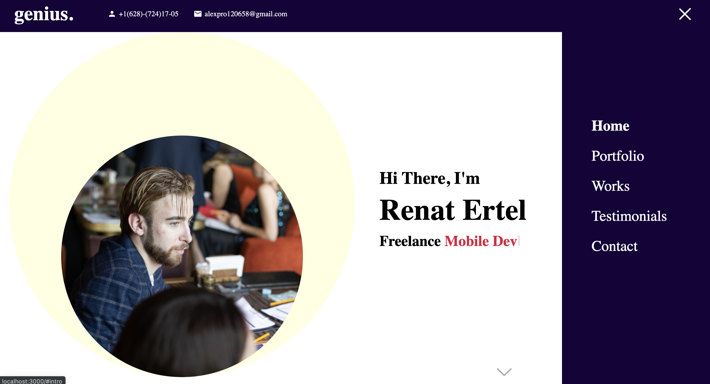
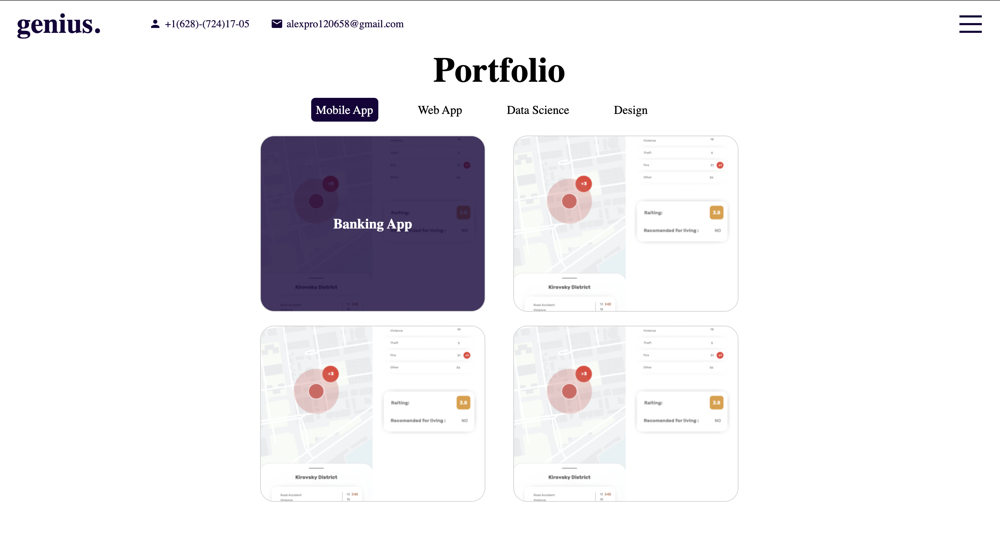
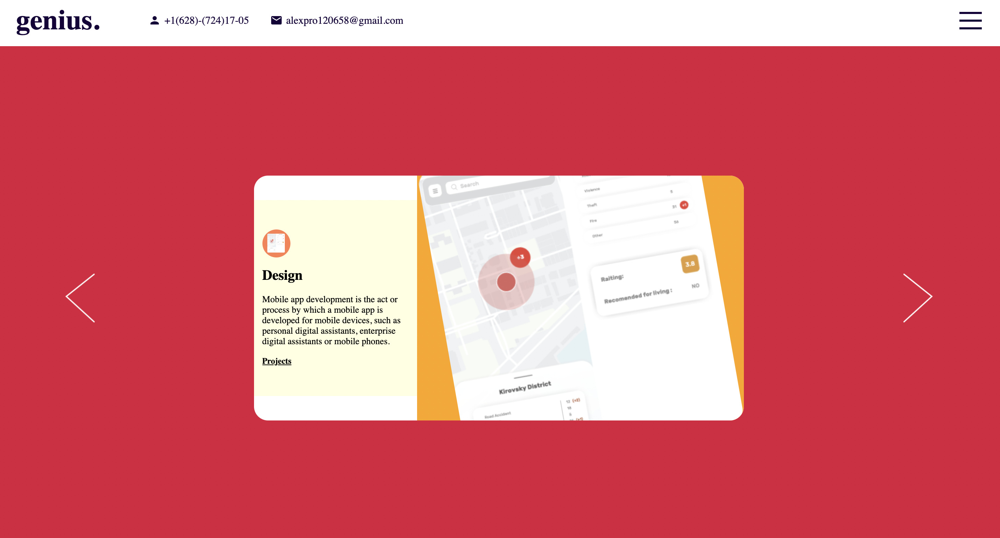
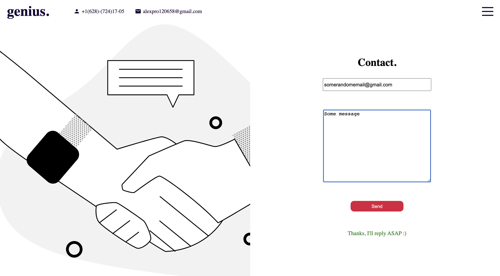

# Installation and launching

First off, you'll have to install npm or yarn package managers  in order to lauch your react project

Next step is go inside my_portfolio folder and open a new window in cmd/terminal in the folder

Then run the project by typing thenext command : npm start ( if you use npm).

